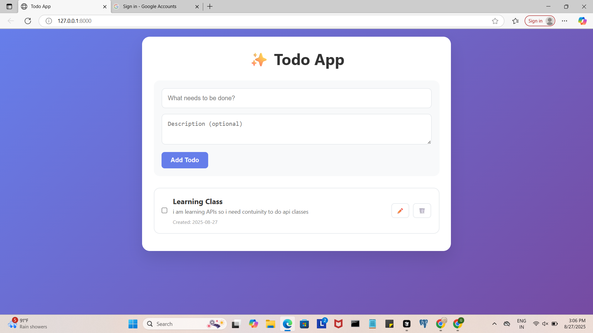

# ✨ Todo App

A beautiful, full-featured Todo application built with Python, Django, and modern web technologies. This app provides a complete CRUD (Create, Read, Update, Delete) interface for managing your daily tasks with a stunning gradient UI and JSON-based data storage.



## 🚀 Features

- **✨ Beautiful UI**: Modern gradient design with smooth animations
- **📝 Full CRUD Operations**: Create, read, update, and delete todos
- **✅ Task Completion**: Mark tasks as complete/incomplete
- **📱 Responsive Design**: Works perfectly on all devices
- **💾 JSON Storage**: Simple file-based data persistence
- **🔒 RESTful API**: Proper HTTP methods for all operations
- **⚡ Real-time Updates**: Instant feedback on all actions

## 🛠️ Tech Stack

- **Backend**: Python 3.x + Django 5.2.5
- **Frontend**: HTML5 + CSS3 + Vanilla JavaScript
- **Data Storage**: JSON file system
- **Styling**: Custom CSS with gradients and animations
- **HTTP Methods**: GET, POST, PUT, DELETE

## 📁 Project Structure

```
todoApp/
├── todoApp/                    # Main Django project folder
│   ├── __init__.py
│   ├── settings.py            # Django configuration
│   ├── urls.py                # Main URL routing
│   ├── wsgi.py                # Web server gateway
│   └── asgi.py
├── todos/                      # Todo app folder
│   ├── __init__.py
│   ├── admin.py               # Django admin configuration
│   ├── apps.py                # App configuration
│   ├── models.py              # Data models
│   ├── views.py               # Business logic & API endpoints
│   ├── urls.py                # App-specific URL routing
│   ├── json_handler.py        # JSON file operations
│   ├── tests.py               # Unit tests
│   └── migrations/            # Database migrations
├── templates/                  # HTML templates
│   ├── base.html              # Base template with common structure
│   └── todos/
│       └── index.html         # Main todo page template
├── static/                     # Static files
│   ├── css/
│   │   └── style.css          # Custom styling and animations
│   └── scripts.js             # Frontend JavaScript functionality
├── data/                       # Data storage
│   └── todos.json             # JSON database file
├── manage.py                   # Django management script
├── requirements.txt            # Python dependencies
└── README.md                   # This file
```

## 🚀 Installation & Setup

### Prerequisites
- Python 3.8 or higher
- pip (Python package installer)

### Step-by-Step Setup

1. **Clone the repository**
   ```bash
   git clone https://github.com/kuntalgaurav2001/Todo-App.git
   cd todo-app
   ```

2. **Create virtual environment**
   ```bash
   python -m venv venv
   
   # On Windows
   venv\Scripts\activate
   
   # On macOS/Linux
   source venv/bin/activate
   ```

3. **Install dependencies**
   ```bash
   pip install -r requirements.txt
   ```

4. **Run migrations**
   ```bash
   python manage.py makemigrations
   python manage.py migrate
   ```

5. **Start the development server**
   ```bash
   python manage.py runserver
   ```

6. **Open your browser**
   Navigate to `http://127.0.0.1:8000` or `http://localhost:8000`

## 📖 How It Works

### Backend Architecture
- **Django Views**: Handle HTTP requests and business logic
- **JSON Handler**: Manages data persistence in JSON files
- **URL Routing**: RESTful API endpoints for all operations
- **Template System**: Dynamic HTML generation

### Frontend Features
- **Responsive Design**: Adapts to all screen sizes
- **Interactive Elements**: Smooth hover effects and transitions
- **Modal System**: Edit todos in popup windows
- **Real-time Updates**: Instant feedback on all actions

### Data Flow
1. User interacts with frontend
2. JavaScript sends HTTP requests to Django backend
3. Django processes requests through views
4. JSON handler reads/writes data to file system
5. Response sent back to frontend
6. Page updates to reflect changes

## 🔧 API Endpoints

| Method | Endpoint | Description |
|--------|----------|-------------|
| `GET` | `/` | Display all todos |
| `POST` | `/api/todos/` | Create new todo |
| `PUT` | `/api/todos/<id>/` | Update existing todo |
| `PUT` | `/api/todos/<id>/toggle/` | Toggle todo completion |
| `DELETE` | `/api/todos/<id>/delete/` | Delete todo |

## 🎨 Customization

### Styling
- Modify `static/css/style.css` to change colors, fonts, and layout
- Update gradient backgrounds in the CSS file
- Customize button styles and hover effects

### Functionality
- Add new features in `todos/views.py`
- Modify data structure in `todos/json_handler.py`
- Update frontend logic in `static/scripts.js`

## 🧪 Testing

Run the test suite:
```bash
python manage.py test
```

## 📱 Browser Support

- ✅ Chrome (recommended)
- ✅ Firefox
- ✅ Safari
- ✅ Edge
- ✅ Mobile browsers

## 🤝 Contributing

1. Fork the repository
2. Create a feature branch (`git checkout -b feature/AmazingFeature`)
3. Commit your changes (`git commit -m 'Add some AmazingFeature'`)
4. Push to the branch (`git push origin feature/AmazingFeature`)
5. Open a Pull Request

## 📄 License

This project is licensed under the MIT License - see the [LICENSE](LICENSE) file for details.

## 👨‍💻 Author

**Gaurav Kumar**  
- **GitHub**: [@kuntalgaurav2001](https://github.com/kuntalgaurav2001)
- **Email**: gauravkmadhuaka@gmail.com

## 🙏 Acknowledgments

- Django community for the amazing web framework
- Modern CSS techniques for beautiful UI design
- Vanilla JavaScript for lightweight frontend functionality

## 📞 Support

If you have any questions or need help with this project:

- 📧 Email: gauravkmadhuaka@gmail.com
- 🐛 Report bugs via GitHub Issues
- 💡 Suggest features via GitHub Discussions

---

**⭐ Star this repository if you found it helpful!**

**🔗 Share with your network to help others discover this project!**
